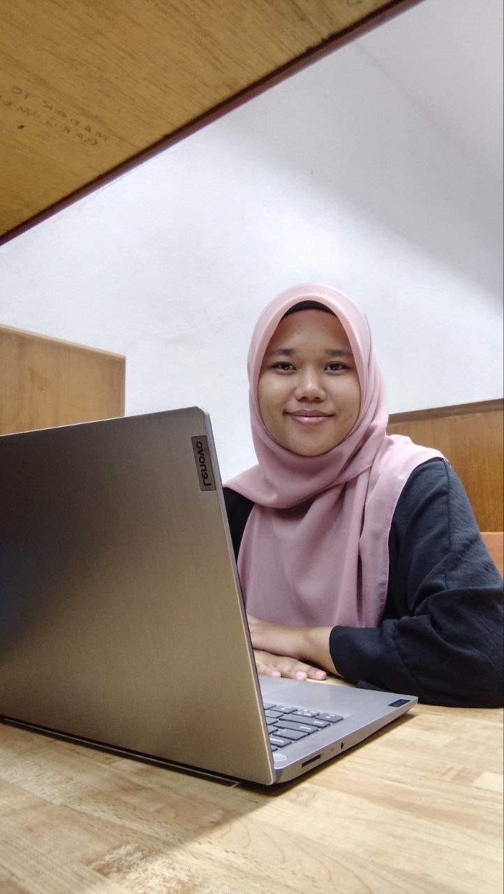

<!DOCTYPE html>
<html lang="en">
<head>
  <meta charset="UTF-8">
  <meta name="viewport" content="width=device-width, initial-scale=1.0">
  <title>Siti Norfarhana Natasha | Portfolio</title>
  <link href="https://fonts.googleapis.com/css2?family=Roboto:wght@400;700&display=swap" rel="stylesheet">
  
</head>
<body>
  

    <header>
      
       <!-- Ensure the correct path to the image -->
      <h1>Siti Norfarhana Natasha binti Mohd Aiesha</h1>
      
Economics graduate specializing in Finance

    </header>

    <section>
      <h2>About Me</h2>
      
I am an Economics soon-to-be graduate from International Islamic University Malaysia, specializing in finance. I am passionate about analyzing financial trends, working with data, and applying quantitative tools such as R and EViews to generate insights and support decision-making.

    </section>

    <section>
      <h2>Education</h2>
      <ul>
        <li>Bachelor of Economics, International Islamic University Malaysia</li>
      </ul>
    </section>

    <section>
      <h2>Skills</h2>
      <ul>
        <li>Microsoft Excel</li>
        <li>R Programming</li>
        <li>EViews</li>
        <li>Canva (Visual & Report Design)</li>
      </ul>
    </section>

    <section>
      <h2>Projects</h2>
      
Coming soon... (You can list your final year project, forecasting models, economic analysis, etc.)

    </section>

    <section>
      <h2>Contacts</h2>
      <ul>
        <li><a href="https://www.linkedin.com/in/siti-norfarhana-natasha-binti-mohd-aiesha-173200278" target="_blank">LinkedIn</a></li>
      </ul>
    </section>

    <section>
      <h2>Resume</h2>
      
<a href="#">Click here to download my resume (upload PDF link)</a>

    </section>

    <footer>
      
&copy; 2025 Siti Norfarhana Natasha. All rights reserved.

    </footer>
  

</body>
</html>
